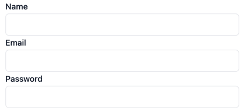

# MantraPHP
The Form builder library for InertiaJs Laravel

> This package is in development stage.

## Development Plans
* [ ] Fields
  * [ ] TextInput
    * [x] Label
    * [x] Type
* [ ] Validation
* [ ] Layouts

## Uses
### Define the Form with PHP
```php
Route::get('/', function () {
    return Inertia::render('Form', [
        'form' => [
            TextInput::make('name'),
            TextInput::make('email'),
            TextInput::make('password')
                ->type('password')
        ]
    ]);
});
```
### Display the Form with `Mantra` Component
```vue
<template>
    <div class="w-[400px] mx-auto">
        <Mantra :data="form"/>
    </div>
</template>
<script setup>
    import Mantra from "../Components/Mantra"

    defineProps({
        form: {
            required: true,
            type: [Object],
        },
    })
```

### Output


